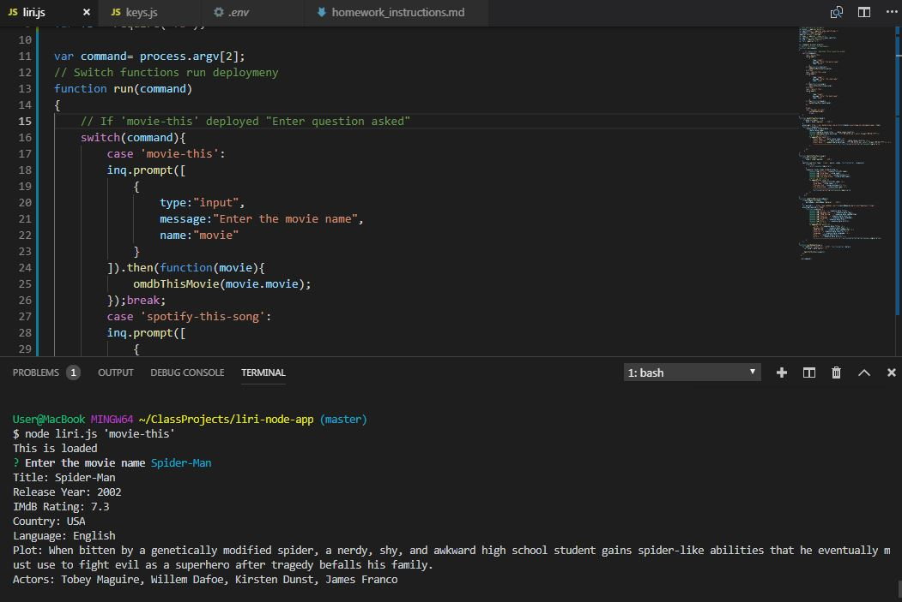

# wk10_Liribot

### SUMMARY

LIRI is like iPhone's SIRI, however, while SIRI is a 	Speech Interpretation and Recognition Interface, LIRI is a 	Language Interpretation and Recognition Interface. LIRI is 	be a command line node app that takes in on parameters  	and returns the relative data.
	`spotify-this-song` `movie-this` `do-what-it-says` `concert-this`

### Deployment

1. Clone repo
2. Run `npm install`
3. At command prompt run `node liri.js <pass in an instruction from above>`

### Screenshot of Progress

## TECHNOLOGIES USED

* NodeJS
* JavaScript
* Spotify API
* Bands in Town API
* OMDB API
* NPM simple-node-logger
* NPM spotify-web-api-node

## Version 1 bugs
- [x] *Fixed* error shown as unable to read given spotify id and secret.
- [x] *Fixed* After `concert-this` band result has no appearance.

### AUTHOR
*Min Joseph*
